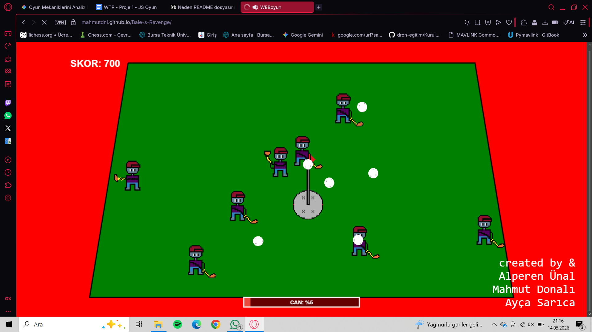
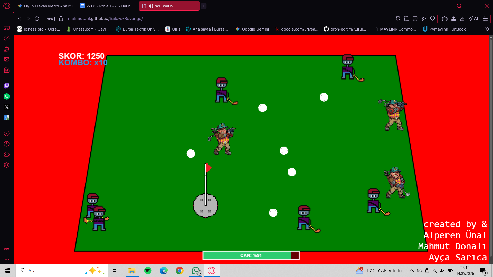

#  Bale's Revenge

Bu proje, G.O.L.P oyunundan ilham alınmış, yüksek skor odaklı bir HTML5 Canvas oyunudur.

🚀 **[OYUNU CANLI OYNAMAK İÇİN TIKLAYIN](https://mahmutdnl.github.io/Bale-s-Revenge/)**

## 🎮 Oyun Mekanikleri ve Zorluklar (Challenge)
*   **Temel Amaç:** Karakterin can değeri tükenmeden golfçüleri ve topları yutarak en yüksek skora ulaşmak.
*   **Hasar Sistemi:** Düşman golfçülerden gelen toplara çarpmak can değerini azaltır.
*   **Kombo Sistemi:** Ardışık yutma eylemleri (5 ve 10 kombo eşikleri) kazanılan puanı katlayarak artırır.
*   **Ölüm Zamanı** Can Değeri 0'a düşerse oyun biter!!.

---

##  Kontroller
| Aksiyon | Tuş Takımı |
| :--- | :--- |
| **Hareket** | `W, A, S, D` veya `Yön Tuşları` |
| **Yutma (Chomp)** | `Space (Boşluk)` |

---

##  Oyun İçi Görüntüler
 
*Görsel 1: Ana menü ve başlangıç sahası.*

*Görsel 2: Karakterin ilerleme ve yönelme mekaniği.*

---

##  Grup Üyeleri
*   **Mahmut Donalı** - (23360859063)
*   **Alperen Ünal** - (23360859061)
*   **Ayça Sarıca** - (23360859052)

---

 
*Görsel 1: Ana menü ve başlangıç sahası.*

---

##  Kullanılan Varlıklar (Assets)
Oyun içerisinde kullanılan ses ve görsel varlıkların kaynakları aşağıda belirtilmiştir:
*   **Görseller:** [assets Klasörü İçerisindeki Dosyalar]
*   **Sesler:** [background.mp3, eat.mp3, hit.mp3]
---
