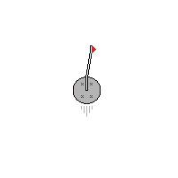

# 🕹️ Bale's Revenge

Bu proje, **G.O.L.P** oyunundan esinlenerek geliştirilmiş, "Rollerin Tersine Çevrilmesi" (Role Reversal) temasını işleyen yüksek skor odaklı bir HTML5 Canvas oyunudur.

🚀 **[OYUNU CANLI OYNAMAK İÇİN TIKLAYIN](https://mahmutdnl.github.io/Bale-s-Revenge/)**

---

## 📖 Proje Hakkında
Bu çalışma, **Web Tabanlı Programlama** dersi kapsamında geliştirilmiştir. Oyunun temel mekaniği, geleneksel golfün aksine bir "golf deliği"ni kontrol ederek sahaya top atan golfçüleri ve topları yutmaya çalışmak üzerine kuruludur.

*   **Hedeflenen Oyun:** [G.O.L.P by Bad Piggy](https://badpiggy.itch.io/golp)
*   **Teknolojiler:** HTML5 Canvas, CSS3, Pure JavaScript (Hiçbir kütüphane kullanılmamıştır).

---

## 🎮 Oyun Mekanikleri ve Zorluklar (Challenge)
*   **Temel Amaç:** Karakterin (Deliğin) can değeri tükenmeden golfçüleri ve topları yutarak en yüksek skora ulaşmak.
*   **Hasar Sistemi:** Düşman golfçülerden gelen toplara çarpmak can değerini azaltır.
*   **Kombo Sistemi:** Ardışık yutma eylemleri (5 ve 10 kombo eşikleri) kazanılan puanı katlayarak artırır.
*   **Dinamik Zorluk:** Süre ilerledikçe düşman sayısı ve top fırlatma hızı artarak oyunun zorluk seviyesini yukarı çeker.

---

## ⌨️ Kontroller
| Aksiyon | Tuş Takımı |
| :--- | :--- |
| **Hareket** | `W, A, S, D` veya `Yön Tuşları` |
| **Yutma (Chomp)** | `Space (Boşluk)` |

---

## 🖼️ Oyun İçi Görüntüler
 
*Görsel 1: Ana menü ve başlangıç sahası.*

*Görsel 2: Karakterin yutma mekaniği ve düşman etkileşimi.*

---

## 👥 Grup Üyeleri
*   **Mahmut Donalı** - (Öğrenci Numaranı Buraya Yaz)
*   **Alperen Ünal** - (Öğrenci Numaranı Buraya Yaz)
*   **Ayça Sarıca** - (Öğrenci Numaranı Buraya Yaz)

---

## 🛠️ Kullanılan Varlıklar (Assets)
Oyun içerisinde kullanılan ses ve görsel varlıkların kaynakları aşağıda belirtilmiştir:
*   **Görseller:** [assets/ Klasörü İçerisindeki Dosyalar]
*   **Sesler:** [background.mp3, eat.mp3, hit.mp3]
*   *(Eğer assetleri bir siteden aldıysan buraya linklerini eklemelisin)*

---
*Bu proje ödev kuralları gereği GitHub Pages üzerinde barındırılmaktadır.*
